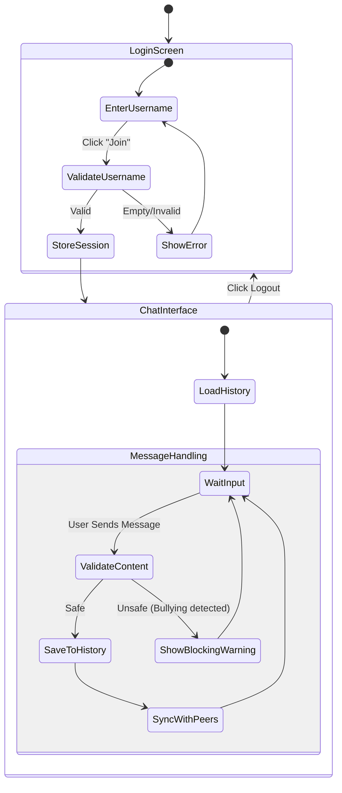
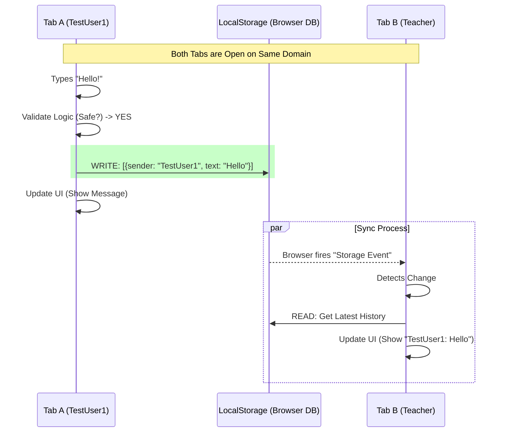

# SafeSpace - Functional Requirements Document (FRD)

## 1. Introduction
**SafeSpace** is a web-based educational chat application designed for 8th-grade students. Its primary purpose is to demonstrate safe digital communication by proactively filtering and blocking bullying, threatening, and profane language in real-time.

The application operates entirely client-side, using browser storage to simulate a persistent chat environment. This Proof of Concept (POC) emphasizes "Privacy by Design" and instantaneous feedback loops to educate users on appropriate online behavior.

---

## 2. User Flow Diagram (High Level)
The following state diagram illustrates the user's journey through the application:

---

## 3. Functional Requirements

### 3.1 User Authentication (Simulation)
**Goal**: Allow users to identify themselves within a session.
*   **FR-01**: System shall provide a Login Screen asking for a "Username".
*   **FR-02**: System shall require a non-empty username to proceed.
*   **FR-03**: System shall store the username in `sessionStorage`.
    *   *Note*: This ensures maintaining identity even if the page refreshes.
*   **FR-04**: System shall provide a "Logout" button that clears the session and returns to the Login Screen.

### 3.2 Chat Interface
**Goal**: Facilitate real-time text communication.
*   **FR-05**: System shall display a scrollable chat history window.
*   **FR-06**: System shall differentiate messages sent by "Me" (current user) vs "Others".
    *   *UI*: "Me" messages aligned right (green); "Others" aligned left (blue).
*   **FR-07**: System shall automatically scroll to the bottom when a new message arrives.

### 3.3 Bullying Detection Engine (The Core)
**Goal**: Prevent harmful content from being published.
*   **FR-08**: System MUST intercept every message *before* it is added to the chat history.
*   **FR-09**: System shall switch-case validation against the following Regex rules:
    *   **Bully Words**: (e.g., "idiot", "loser", "ugly").
    *   **Threats**: (e.g., "kill you", "beat you", "wait and see").
    *   **Profanity**: (e.g., standard prohibited list).
*   **FR-10**: If a violation is found:
    *   The message MUST NOT be sent.
    *   The input box MUST indicate an error state (Red border / shake).
    *   A "Validation Feedback" box MUST appear explaining *exactly* why.
        *   *Example*: "Blocked because it contains unkind word: 'idiot'".

### 3.4 Multi-User Simulation (The "Local" Backend)
**Goal**: Simulate a real chat room using only the browser.
*   **FR-11**: System shall use `localStorage` as the shared database for tea-time history.
*   **FR-12**: System shall listen for updates to `localStorage` (via `storage` event or polling).
*   **FR-13**: When Tab A writes to `localStorage`, Tab B MUST automatically detect the change and update its UI within 1 second.
*   **FR-14**: System shall support concurrent users in separate browser tabs (sharing the same Origin).

---

## 4. Technical Architecture Logic
This diagram explains how the "Serverless" sync works between two tabs:

---

## 5. Non-Functional Requirements
*   **NFR-01 Compatibility**: Application must function on modern browsers (Chrome, Safari, Edge).
*   **NFR-02 Privacy**: No data shall leave the user's device. All storage is local.
*   **NFR-03 Performance**: Message validation must occur in under 100ms.
*   **NFR-04 Accessibility**: Fonts must be legible (Nunito/Comic Neue) and contrast ratios should be sufficient for reading.

## 6. Future Enhancements (Roadmap)
*   **Persistent Backend**: Move from LocalStorage to a real database (Firebase/AWS).
*   **AI Moderation**: Use an LLM API to detect subtle bullying (sarcasm) that Regex misses.
*   **User Reporting**: Allow users to "Report" a message that slipped through filters.
